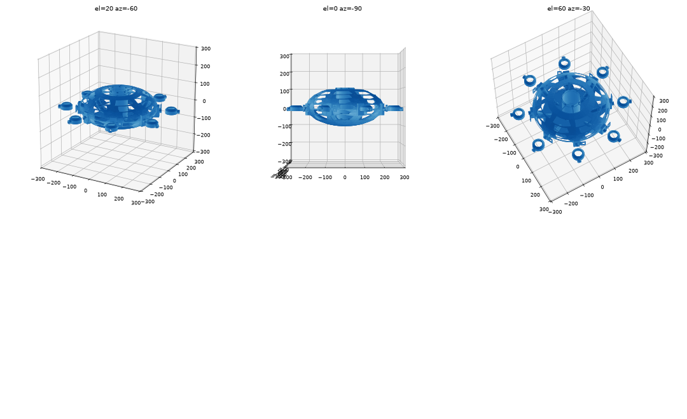

# Propulsion: fan, thrust pipes and air-multiplier thrusters (926, v0)

## How the air moves
1. The impeller at the bottom of the central shaft pulls air **down the shaft**.
2. It throws the air outward into the **plenum** between the floor (z = −70) and the keel. The shaft, floor and keel are solid, airtight walls; glue their seams with epoxy.
3. The plenum feeds the **8 thrust ducts**, which run *inside* the skin to the equator. The hull's outside stays smooth.
4. At each seam a rotating **stem** passes through a round hole in the skin. Its flange sits behind a bearing boss inside the duct, and it carries a printed **air-multiplier ring** with a Coanda lip and a 0.8 mm slot.
5. An MG90S servo **inside the hull** turns the stem through a 1:1 pair of 36-tooth gears just outside the skin, giving ±90° of travel. Only the stem and the servo gear's hub pass through the skin. The swivel axis is radial, so each jet can point anywhere between up/down and sideways along the hull. Together the 8 thrusters give lift, yaw, surge and sway.

## Parts
Print from `print/*.stl`. Each file is already posed for printing: PLA, 0.2 mm layers, 0.4 mm nozzle, MK3S+.

| Part | Qty | cm³ each | Print notes |
|---|---|---|---|
| `impeller` | 1 | 4.8 | Backplate on the bed; no supports. Open (unshrouded) backward-curved rotor, 88 mm, 7 blades. Lightened: 0.8 mm backplate, 0.86 mm blades, and a scalloped rim (the backplate is cut away between the blades beyond a 32 mm radius), about 5.9 g. It is balanced by design; still check it on a pencil. |
| `motor_spider` | 1 | 8.0 | Flat; no supports. Sits on the 2 mm ledge inside the shaft at z = −46. The A2212 bolts **under** it (4 × M3 × 6, 16 or 19 mm pattern). |
| `servo_mount` | 8 | 3.8 | Plate down; no supports. Epoxy it to the inside of the skin, centred on the Ø8 servo hole. The servo drops in with its spline outward and is held by two M2 screws driven from inside the hull. |
| `stem` | 8 | 1.9 | Flange down; no supports. Put it into the stem hole from inside the half-duct **before** joining the neighbouring slice. Wrap it in PTFE tape. |
| `stem_gear` | 8 | 2.8 | Flat. Glue it on the stem's D-flat. |
| `servo_gear` | 8 | 3.8 | Hub down. Its hub reaches through the Ø8 skin hole onto the servo spline. Glue it and fix it with the servo's horn screw from outside. |
| `thruster_ring` | 8 | 11.1 | Exit down, axis vertical; no supports. Every surface faces up or overhangs 45° or less. Check the 0.8 mm slot is clear; a blade of 0.6 mm shim works. |

- **Total printed propulsion:** about 200 cm³, roughly 250 g of PLA.
- **Parametric source:** `propulsion.py`. All dimensions are at the top.
- **Fit checks:** `check_fit.py` checks the parts against the hull: the motor unit, the stems, the servos and their mounts, the gears, and the rings at −90…+90°, including against the neighbouring thruster. They all pass.

## Assembly order
1. Assemble the slices. Epoxy the shaft, floor and keel seams so they are airtight.
2. **Stems and servo mounts, while the slices are still apart.**
   - Put each stem into its stem hole from inside the open half-duct, then join and epoxy the neighbouring slice. This closes the duct and traps the stem's flange behind the boss.
   - Epoxy each servo mount inside the skin over its Ø8 hole. Drop the servo in and screw it from inside.
3. **Gears and rings.**
   - Centre the servos (the firmware centres every servo at boot).
   - Mesh the gears with the ring's exit pointing **down**, then glue the ring onto the stem.
4. **Fan unit.**
   - Bolt the A2212 under the spider and clamp the impeller on the prop adapter.
   - Lower the whole unit **down the shaft from the top** until the spider sits on the ledge. The 88 mm impeller passes the ledge's 90.8 mm bore.
   - The impeller's blade tops end 0.8 mm below the shaft mouth. The prop adapter's shoulder sets the height; adjust `ADAPTER_SHOULDER` if yours differs.
5. Wire it up as in [../../Electronics/README.md](../../Electronics/README.md).

## Known limits of v0 (to bench-test)
- **Impeller:** it's open, so some air slips over the blade tops. The scalloped rim also lets some air fall back from the plenum into the passages. If plenum pressure comes out low, try `IMP_SCALLOP_R = 44` (no scallops, +3.5 g) before adding a printed shroud ring.
- **Motor choice:** the A2212 is the cheap, common choice but heavy (~50 g). A 2205–2207 drone motor saves ~25 g if the fan needs less power than expected.
- **Swivel seal:** it's a plain bore through the skin and boss, with PTFE tape, and some leakage is expected. Measure it before adding an O-ring.
- **Servo height:** it depends on your MG90S. If the gear hub doesn't reach the spline, shim under the servo's tabs.
- **Air-multiplier slot:** 0.8 mm is at the limit of FDM accuracy. Try 0.6 or 1.0 mm (`SLOT`) and compare thrust on the scale.
