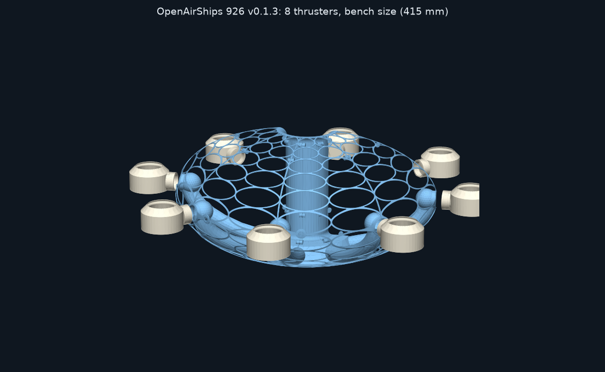
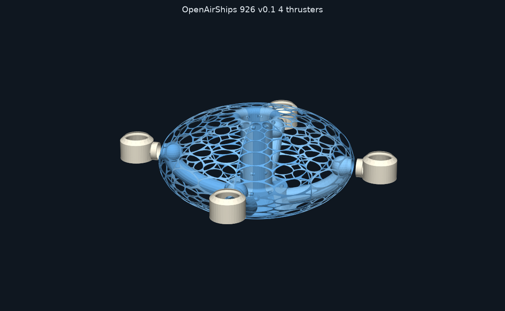
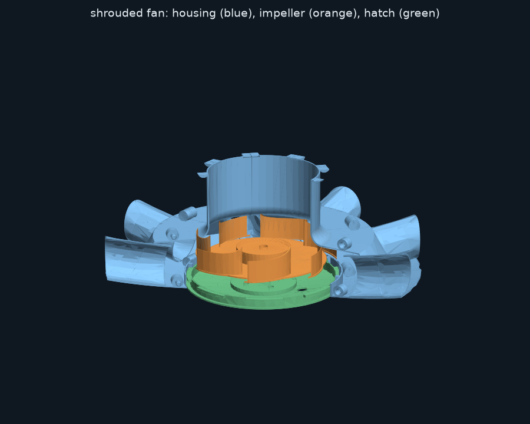
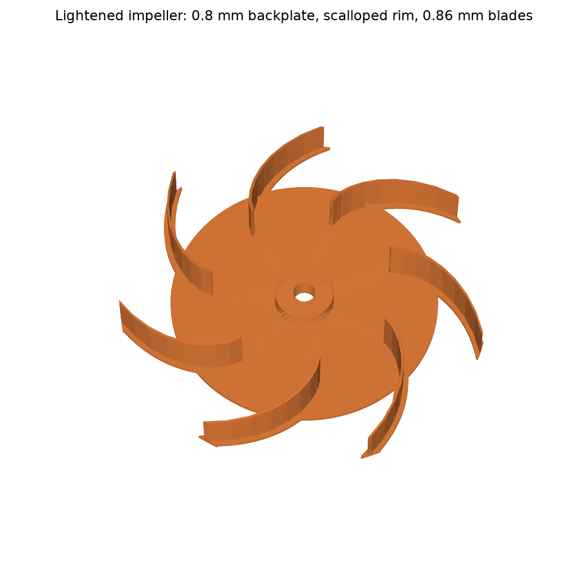
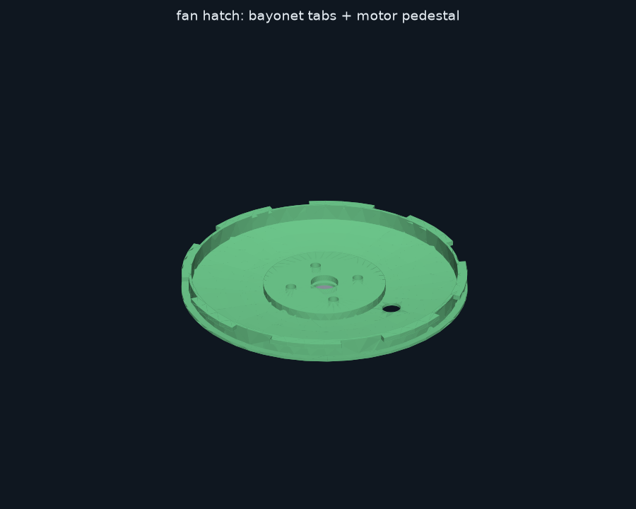
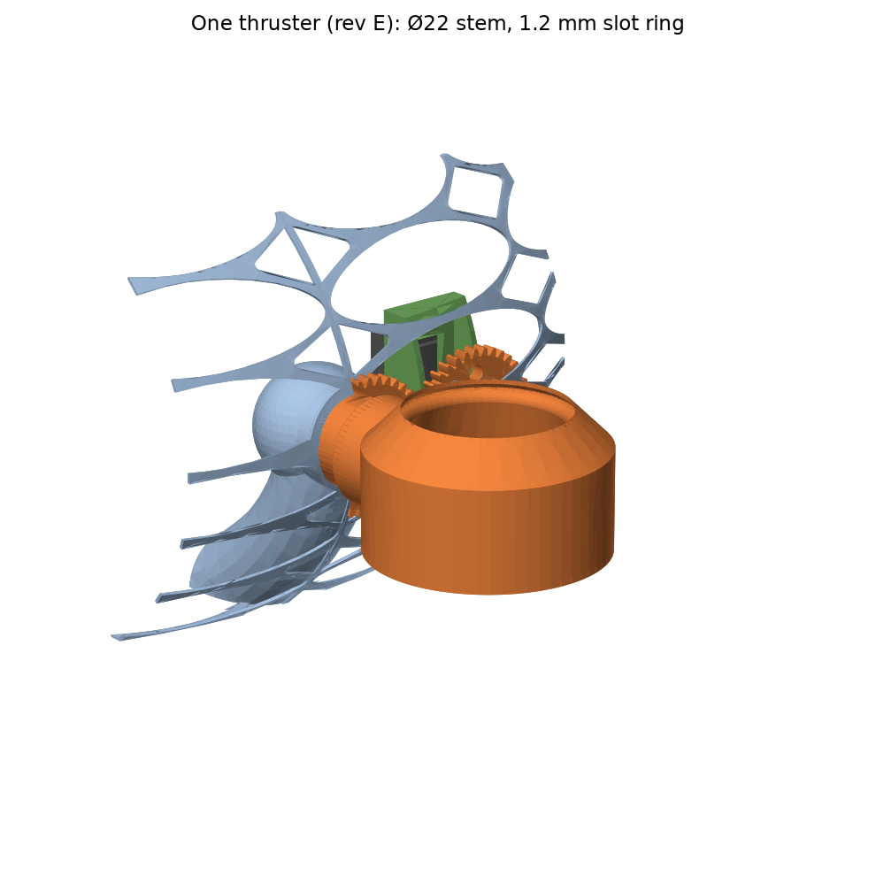

# Propulsion: shrouded fan, thrust ducts and air-multiplier thrusters (926 v0.1)

## Versions
The same parametric source (`propulsion.py`) builds the parts for every hull version. Set the version with `OAS_VARIANT=8T|4T` and `OAS_SCALE=1|1.9`, as for the slices.

| Version | Folder | Thrusters | Duct / stem | Ring | Gears | Expected thrust |
|---|---|---|---|---|---|---|
| 8 thrusters, bench | `.` (this folder) | 8 | Ø24 / Ø25-22 | 64 mm OD, 1.6 mm slot | 36T m1 | ≈ 408 gf |
| 4 thrusters, bench | `4T/` | 4 | Ø34 / Ø34-31 | 69 mm OD, 2.0 mm slot (same profile as 8T) | 44T m1 | ≈ 422 gf |
| 8 thrusters, Kobra Max | `x1.9/` | 8 | as 8T | as 8T | as 8T | ≈ 401 gf |
| 4 thrusters, Kobra Max | `4T/x1.9/` | 4 | as 4T | as 4T | as 4T | ≈ 418 gf |
| **v0.2 double Kobra** (x3.8, 12 slices) | `4T/small/12s/x3.8/` | 4 | as 8T (Ø24 / Ø25-22) | as 8T | as 8T | ≈ 306 gf |

- **4 thrusters:** each duct carries twice the flow, so the ducts, stems and rings are sized up to keep the air speeds down (see [AIRFLOW-4T.md](../../Analysis/AIRFLOW-4T.md)). Otherwise the parts and the assembly are the same as for 8 thrusters, with half as many.
- **Kobra Max size:** the fan, thrusters and servos keep their size. Only the hull grows, so the servo mount and fan hatch follow the flatter hull curve, and the ducts get longer.
- **v0.2 double Kobra:** 4 thrusters with the 8-thruster hardware, SG90 servos, a 12-tab fan hatch and the **avionics tray** (`avionics_tray.step`, 24 cm³).
  - **Tray:** a ring clamps round the lower intake tube just above the fan housing, with 4 arms reaching out between the ducts. Two arms carry battery cradles (40 × 70 × 20 mm, one 2S pack each, opposite each other for balance). The other two carry plates for the ESC, ESP32, BEC and IMU.
  - **Why the fan and ducts aren't scaled up:** the ship floats on hydrogen, so the fan only manoeuvres it. 306 gf moves the 1.58 m hull at about 2.5 m/s, which is plenty indoors. The 4-thruster Ø34 ducts would add about 60 g of duct wall. A bigger fan would add more again: motor, ESC, battery current and a wider shaft.
  - **To scale it up later:** set `OAS_THRUSTER=L` for the Ø34 ducts, stems and 69 mm rings. The fan is set by `IMP_R` / `SHAFT_R`.
  - Build it with the v0.2 settings in the slice README, plus `python3 propulsion.py`.
- **Assembly:** a 4-thruster hull alternates left and right slices. Each left/right pair closes one duct, and its right slice carries the servo hole.

## How the air moves
1. The impeller pulls air in over the bellmouth at the top of the hull and **down the smooth central shaft**. Nothing sits in the shaft: the motor stands on the fan hatch in the keel, under the impeller.
2. The shaft is the impeller eye's diameter (Ø66) all the way down. At the bottom the hull's own housing wall curves over the blade tips with 1.5 mm clearance, so the **housing acts as the fan's shroud**. The impeller throws the air outward into the housing, and it can't leak back up the shaft.
3. The housing feeds the **8 thrust ducts**, which run *inside* the skin to the equator. The hull's outside stays smooth.
4. At each thruster seam a rotating **stem** passes through a round hole in the skin. Its flange sits behind a bearing sleeve inside the duct, and it carries a printed **air-multiplier ring** with a Coanda lip and a 1.6 mm slot (2.0 mm on 4 thrusters).
5. An MG90S servo **inside the hull** turns the stem through a 1:1 pair of 36-tooth gears just outside the skin, giving ±90° of travel. The thrusters sit exactly on the equator. Their swivel axis is radial, so each jet can point anywhere between up/down and sideways along the hull. Together the thrusters give lift, yaw, surge and sway.

Expected thrust (8 thrusters): **about 4.0 N (≈ 410 gf)** at 15,650 rpm, 62 L/s. The range is 306–564 gf depending on the fan efficiency and air-multiplier gain measured on the bench; see [../../Analysis/AIRFLOW.md](../../Analysis/AIRFLOW.md).

## Parts
Print from the version's `print/*.stl`. Each file is already posed for printing: 0.2 mm layers, 0.4 mm nozzle. The table gives the 8-thruster bench sizes; 4-thruster rings are 19.8 cm³, stems 4.9, gears 2.4 and 4.8, and the fan hatch 11.3.

| Part | Qty | cm³ each | Print notes |
|---|---|---|---|
| `impeller` | 1 | 6.2 | **PETG**; the tip runs at 72 m/s. Backplate on the bed; no supports, as the cup top bridges 31 mm. Backward-curved rotor, 88 mm, 7 blades, sized by the airflow analysis: eye Ø66, exit width 12.5 mm. The blade tops follow the housing's shroud curve. Lightened: 0.8 mm backplate, 0.86 mm blades, scalloped rim. A 0.86 mm **cup** fits over the motor bell, and its 2 mm top disc is clamped between the bell and the M5 prop nut. About 8 g. Balanced by design; still check it on a pencil. |
| `fan_hatch` | 1 | 10.1 | The keel under the fan, removable. Dish down; use **supports on build plate only**, since the dish's outside is part of the hull curve and rises 2.7 mm at the rim. It carries the motor pedestal (4 × M3 × 6, 16 × 16 mm, screwed from below), a spigot wall, 8 bayonet tabs and a Ø6 wire hole. |
| `servo_mount` | 8 | 4.3 | Plate down; no supports. Epoxy it to the inside of the skin, centred on the Ø8 servo hole. The servo drops in with its spline outward and is held by two M2 screws driven from inside the hull. |
| `stem` | 8 | 3.6 | Flange down; no supports. Put it into the stem hole from inside the half-duct **before** joining the neighbouring slice. Wrap it in PTFE tape. |
| `stem_gear` | 8 | 2.1 | Flat. Glue it on the stem's D-flat. |
| `servo_gear` | 8 | 3.8 | Hub down. Its hub reaches through the Ø8 skin hole onto the servo spline. Glue it and fix it with the servo's horn screw from outside. |
| `thruster_ring` | 8 | 14.1 | Exit down, axis vertical; no supports. Every surface faces up or overhangs 45° or less. Check the 1.6 mm slot is clear; a 1.5 mm shim works. |

- **Total printed propulsion:** about 233 cm³ (≈ 290 g of PLA) for 8 thrusters, or 154 cm³ (≈ 190 g) for 4, plus the PETG impeller (≈ 8 g). Lightweight PLA for the rings and servo mounts saves about a third of theirs; see [FLOAT.md](../../Analysis/FLOAT.md).
- **Motor:** 2207 1750 KV on 4S (≈ 32 g, ≈ 25 A at full throttle). It must spin **counter-clockwise seen from above**; swap any two motor wires if it doesn't.
- **Parametric source:** `propulsion.py`. All dimensions are at the top.
- **Fit checks:** `check_fit.py` runs 35 checks against the assembled hull, and they all pass for all four versions. They cover:
  - the impeller under the shroud (≥ 1.2 mm clearance) and its path up through the hatch opening
  - the hatch at its insert angle, at 5–15 mm below seated, and locked
  - the motor and prop nut, the stems, the servos and their mounts, the gears
  - the rings at −90…+90°, including against the neighbouring thruster

## The fan hatch (bayonet)
- Each slice carries a lug and a stop post on the ring wall round the keel opening. The hatch has 8 tabs.
- **To fit it:** turn the hatch so its tabs sit on the seams (between the lugs), push it up flush, then **turn it 11.5° clockwise (seen from above)** until the tabs hit the stop posts.
- **What holds it:**
  - The housing pressure (≈ 1,900 Pa, about 13 N on the hatch) presses the tabs down onto the lugs.
  - The motor's reaction torque is clockwise, so it pushes the tabs against the posts. The hatch can't unscrew itself while the fan runs.
- **Seal:** run a strip of tape round the outside seam.

## Assembly order
1. **Slices.** Epoxy the seams of the shaft and contraction, the housing wall, the keel round the hatch ring, and the ducts, so they are airtight.
2. **Stems and servo mounts, while the slices are still apart.**
   - Put each stem into its stem hole from inside the open half-duct, then join and epoxy the neighbouring slice. This closes the duct and traps the stem's flange behind the boss.
   - Epoxy each servo mount inside the skin over its Ø8 hole. Drop the servo in and screw it from inside.
3. **Gears and rings.**
   - Centre the servos (the firmware centres every servo at boot).
   - Mesh the gears with the ring's exit pointing **down**, then glue the ring onto the stem.
4. **Fan unit** (any time after assembly, and removable for service).
   - Bolt the 2207 to the hatch's pedestal (4 × M3 × 6 from below). Pass its wires through the Ø6 hole and seal the hole around them.
   - Put the impeller on the motor shaft: its cup sits on the bell. Fix it with the M5 prop nut and trim any shaft past the nut.
   - Offer the whole unit up through the keel opening and lock the bayonet (above). The blade tops then run 1.5 mm under the shroud.
   - This relies on the motor measuring 20 mm from mount face to bell top (`MOTOR_L`). Shim under the motor, or change `MOTOR_L` and reprint, if yours differs.
5. Wire it up as in [../../Electronics/README.md](../../Electronics/README.md).

## Known limits (to bench-test)
- **Fan efficiency:** the analysis assumes 0.42 for the shrouded housing, against 0.35 for an open impeller. Measure housing pressure and motor power against throttle and put the result into `airflow.py`. The scalloped rim lets a little air fall back into the blade passages; if pressure comes out low, try `IMP_SCALLOP_R = 44` (no scallops, +3.5 g).
- **Motor cooling:** the 2207 sits under the impeller, in the housing's airflow. Check it's warm, not hot, after a full-throttle run.
- **Swivel seal:** it's a plain bore through the skin and sleeve, with PTFE tape, and some leakage is expected. Measure it before adding an O-ring.
- **Servo height:** it depends on your MG90S. If the gear hub doesn't reach the spline, shim under the servo's tabs.
- **Air-multiplier slot:** 1.6 mm is the analysis optimum for this fan within the 75 m/s tip-speed limit. Try 1.4 or 1.8 mm (`SLOT`) and compare thrust on the scale.
