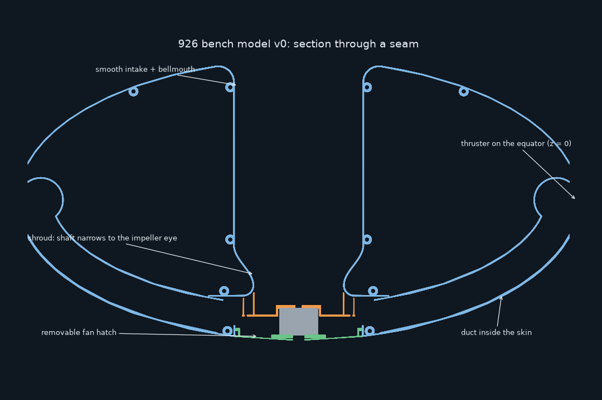
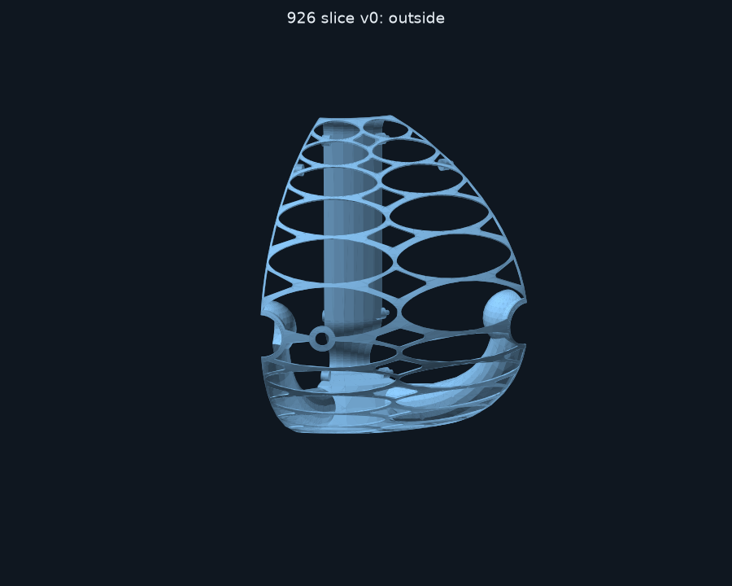
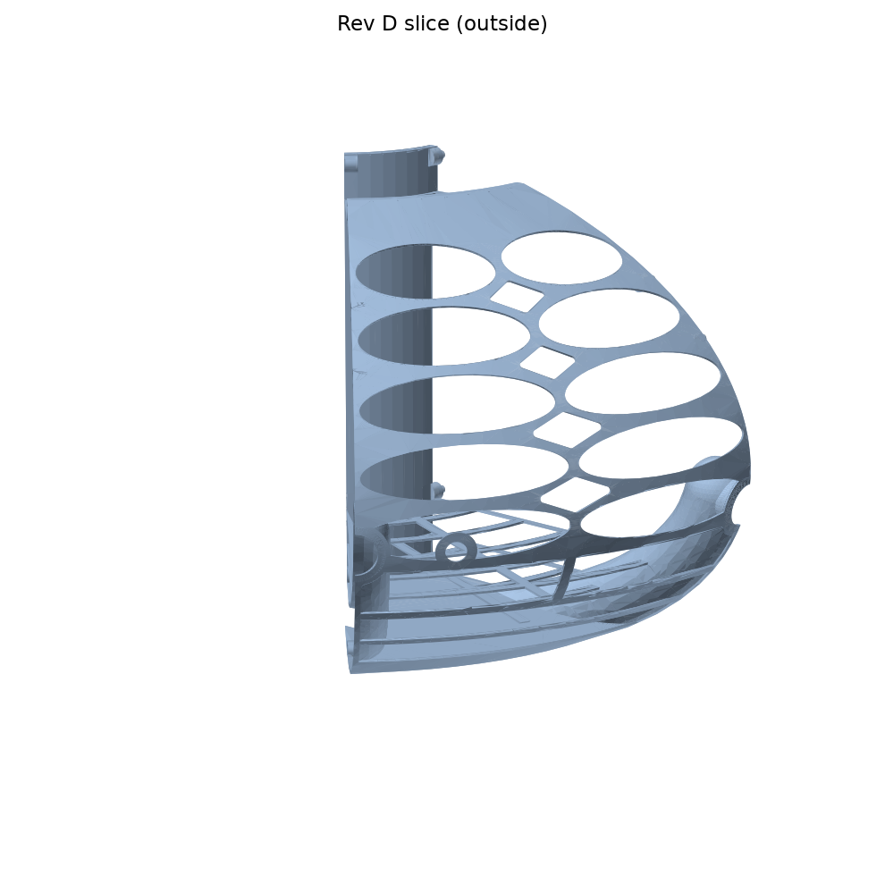
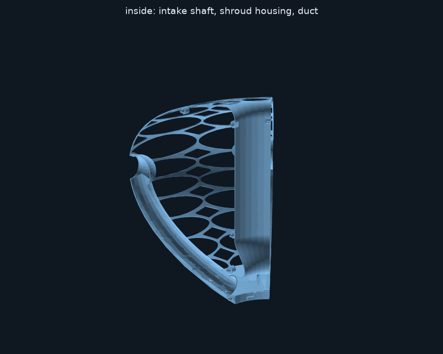
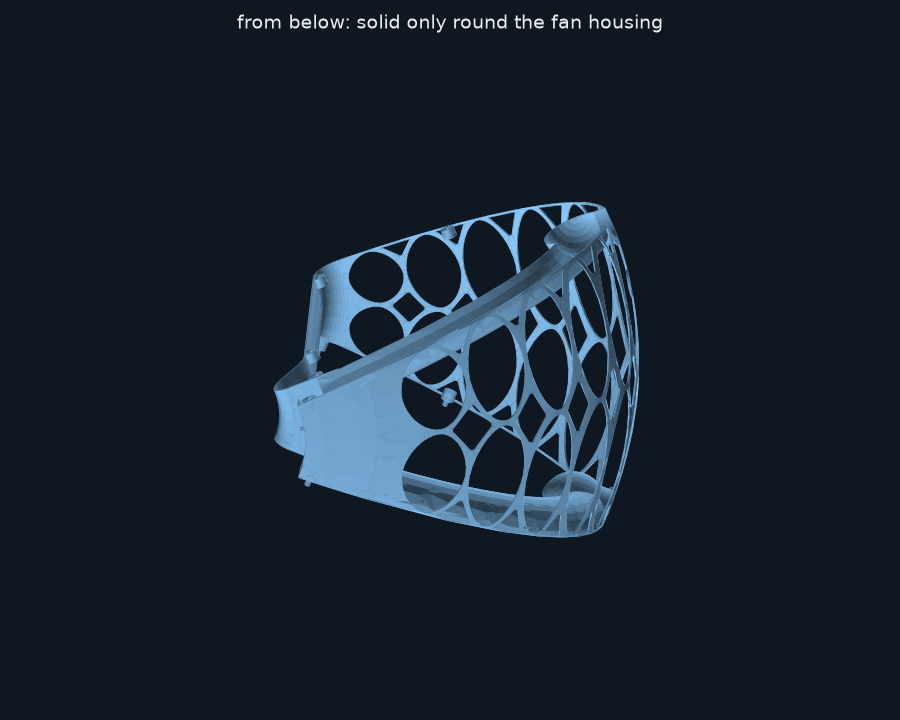
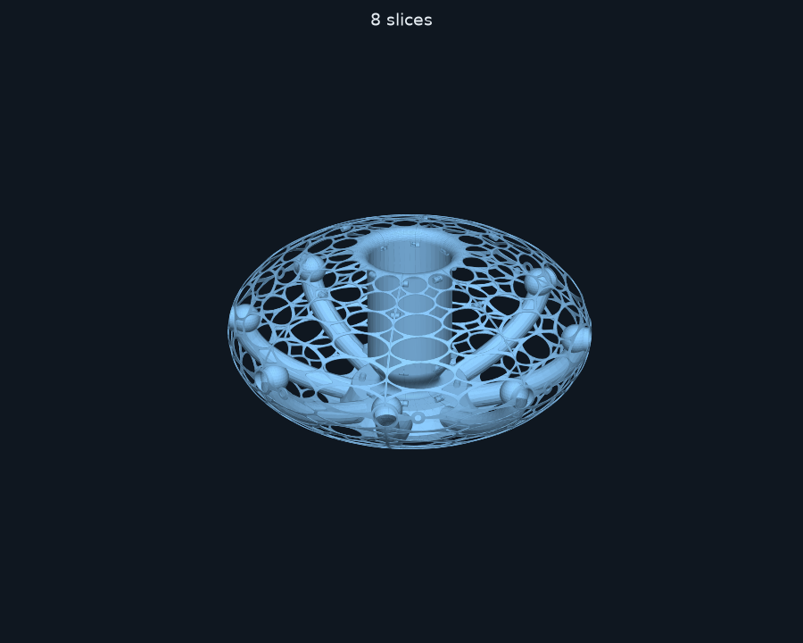

# Airship pie slice 926, rev E (bench model v0): lattice everywhere except the air path

One 45° slice of the hull. Eight identical copies plug together into the full ship.
It keeps the outline of `../airship pie slice 125.FCStd` (the 207.765 × 104 mm ellipse), rebuilt as clean parametric geometry and cut down for the bench demo.
See [../../DESIGN-CONSTRAINTS.md](../../DESIGN-CONSTRAINTS.md) for the fixed rules.

## What's in a slice
- **Skin:** a smooth ellipsoid outside. The skin runs in one arc from the keel up over the top and **rolls into the intake shaft over a 12 mm bellmouth**. There's no trough, shelf or lip any more.
- **Intake shaft:** a plain 0.86 mm tube (Ø94.75 mm bore) from the bellmouth down to the fan. **Nothing is inside it:** no ledge, no spider, no windows. It must stay solid and smooth for the craft's Coanda intake flow.
- **Shrouded fan housing:** the housing *is* the fan's shroud.
  - At the bottom, the shaft narrows smoothly (a 30 mm cosine contraction) to the Ø66 impeller eye.
  - It then turns from axial to radial over the blade tips, with 1.5 mm clearance, and runs out flat at z = −71.3 as the housing ceiling. At r = 66 it slopes down to meet the keel at r = 80.
  - There's no gap left between the impeller tip and the shaft wall, so housing air can't leak back up the shaft. The open design had a 3.4 mm ring there.
  - The housing holds the impeller (r 44) and the 8 duct mouths (r ≈ 58–60). **The keel is solid only around this housing.**
- **Fan hatch opening:** the keel under the fan is a Ø94 opening. The 88 mm impeller goes in and out through it. A ring wall round it carries this slice's **bayonet lug** and **stop post**. The removable `fan_hatch` (see `../Propulsion`) locks onto the 8 lugs and carries the motor.
- **Ducts:** 8 × Ø24 mm, run *inside* the skin from their mouths in the fan housing up to the equator. Each is split by the seam plane, so two slices close it. They end in a Ø32 bulb behind the stem hole (Ø25.4) and its bearing sleeve. Their own 0.86 mm walls keep them airtight; the lattice runs straight over them.
- **Lattice:** everything else is structure only.
  - Two columns of large oval cells, with 2.0 mm ribs.
  - Three rows over the keel outside the fan housing, three from there to the equator and six above it (equal arc lengths).
  - A **ring rib on the equator (z = 0)** carries the thruster stem and servo holes. Thrusters stay exactly on the equator, for navigation.
  - **Every junction is a hollow diamond.** On the seams each slice has a hollow half-diamond that stops at a continuous 1 mm edge strip, so the two slices' strips glue into one full rib.
- **No decks.** The main and lower decks are gone in this bench model.
- **Joints:** 5 bosses along each seam (shaft under the bellmouth, upper skin, shaft above the contraction, housing ceiling, keel outside the hatch ring), all at the same (r, z) positions.
  - The +22.5° seam has Ø3 × 3.6 mm pegs; the −22.5° seam has Ø3.3 × 4.2 mm holes.
  - Both have 0.4 mm chamfers, giving 0.15 mm clearance per side.

## Checked
- The part is a single valid solid.
- Only the 5 pegs stick out of the hull.
- A slice rotated 45° overlaps its neighbour by 0 mm³.
- The keel round the hatch, the housing/shroud wall and the shaft wall are complete. Their only openings are where the ducts leave the housing.
- The duct walls' only openings are the stem holes.
- No material sits inside the shaft bore, the contraction or the eye.
- The STL is watertight.
- `../Propulsion/check_fit.py` passes (35 checks). They cover:
  - the impeller under the shroud (≥ 1.2 mm clearance) and its path up through the hatch opening
  - the hatch at its insert angle and locked, and the motor and prop nut
  - the stems, servos, gears, and rings at −90…+90°

## Weight and volume
- **Printed slice:** about 32 cm³, about 40 g of PLA per slice and **about 320 g for the hull**. Rev D was 48 g per slice.
- **Free interior space** (inside the skin, outside the shaft, fan housing and ducts): about **2.0 L per slice, 16 L for the ship**.
  - Filled with hydrogen, that lifts about 2.2 g per slice, about 18 g for the ship.
  - It's there for ballonet experiments; it won't float the bench model.

## Printing (Prusa MK3S+, PrusaSlicer, PLA)
- **File:** `Print Files/PieSlice926clauderevE.stl`. It is already laid flat on the −22.5° (hole) seam.
  - Footprint: about 207 × 201 mm.
  - Height: 146 mm.
  - Revs A–D are kept for comparison. RevB and revC have a duct leak, so don't print them.
- **Walls:** 0.20 mm QUALITY profile with 2 perimeters. Don't let "detect thin walls" change them.
- **Overhangs:**
  - The skin never overhangs more than 45°.
  - Printed on the seam, oval tips and diamond corners point up, so the ribs are carried by sloping edges rather than bridges.
- **Supports:** use supports **on build plate only**, and paint them inside the duct arch lying on the bed. Nothing else needs support.
- **Brim:** add a 3 mm brim.
- **Airtight seams:** when assembling, epoxy the seams of the shaft and contraction, the housing wall, the keel round the hatch ring, and the ducts. Tape the hatch's outside seam.

## Files
- `airship pie slice 926.FCStd`: FreeCAD document. It contains the part as the base feature of a PartDesign Body, plus a parameter spreadsheet.
- `airship pie slice 926.step`: the same part as STEP.
- `airship_slice.py`: the parametric source (CadQuery). The lattice, housing, ducts and joints are all set at the top of the file.
- `make_fcstd.py`: builds the FCStd and the print STL.

To regenerate: `pip install cadquery && python3 airship_slice.py && freecadcmd make_fcstd.py`
