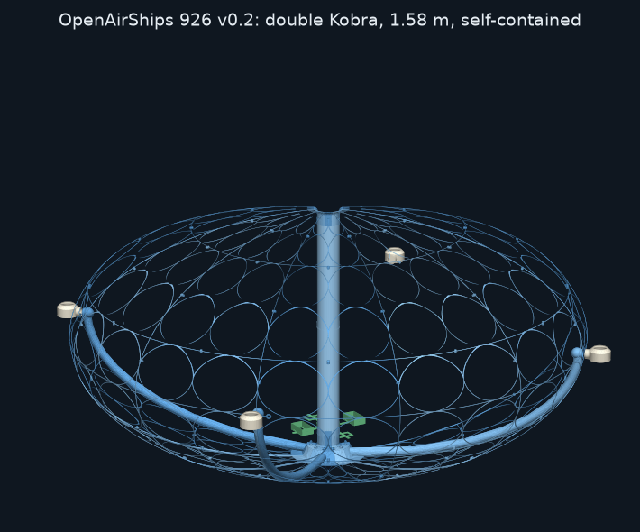

# Airship pie slice 1026 (v0.2.1): 8- and 4-thruster designs, bench, Kobra Max and double-Kobra sizes

One 45° slice of the hull; eight of them plug together into the full ship. The source is one parametric file that builds every version:

| Version | Slices | Print file (in `Print Files/`) | Size | Printer |
|---|---|---|---|---|
| **8 thrusters, bench** | 8 identical | `PieSlice1026-v0.2.1-8T.stl` | 415 mm across | Prusa MK3S+ (or any 210 × 210 mm bed) |
| **4 thrusters, bench** | 4 left + 4 right, alternating | `PieSlice1026-v0.2.1-4T-left.stl`, `…-4T-right.stl` | 415 mm | Prusa MK3S+ |
| **8 thrusters, Kobra Max** | 8 identical | `PieSlice1026-v0.2.1-8T-KobraMax.stl` | 790 mm | Anycubic Kobra Max (400 × 400 × 450 mm) |
| **4 thrusters, Kobra Max** | 4 left + 4 right | `PieSlice1026-v0.2.1-4T-left-KobraMax.stl`, `…-right-KobraMax.stl` | 790 mm | Kobra Max |

It keeps the outline of `OldFiles/CAD/airship pie slice 125.FCStd` (archived at the repository root): the 207.765 × 104 mm ellipse, rebuilt as clean parametric geometry. See [../../DESIGN-CONSTRAINTS.md](../../DESIGN-CONSTRAINTS.md) for the fixed rules and [../../Analysis/FLOAT.md](../../Analysis/FLOAT.md) for weights, hydrogen volume and lift.


## What's in a slice
- **Skin:** a smooth ellipsoid outside. The skin runs in one arc from the keel up over the top and **rolls into the intake shaft over a 12 mm bellmouth**.
- **Intake shaft:** a plain 0.86 mm tube, **Ø66 all the way from the bellmouth down to the impeller eye.** Nothing is inside it: no ledge, no spider, no windows. It must stay solid and smooth for the craft's Coanda intake flow.
  - Up to v0 the shaft was Ø95 and narrowed at the bottom. That width was only needed to drop the impeller in from the top, and it now comes in through the keel hatch.
  - The narrower shaft costs about 1% of the fan pressure and gives the gas cells about 0.6 L more room.
- **Shrouded fan housing:** the housing *is* the fan's shroud.
  - At the bottom of the shaft the wall turns from axial to radial over the blade tips, with 1.5 mm clearance, and runs out flat as the housing ceiling. That's z = −71.3 for 8 thrusters, or 10 mm higher for 4 thrusters so the bigger duct mouths fit.
  - Past the blade tips the ceiling eases down to meet the ducts' tops at their mouths. The outer wall stands just past the mouths, at r = 60.5, and drops straight to the keel.
  - The keel skin is the housing's floor. Each duct hugs the hull curve from its mouth, so **it runs straight on from the housing, flush top and bottom**, with no step for the air to trip over (since v0.2.1).
  - The housing holds the impeller (r 44) and the duct mouths (r ≈ 57–60). **The keel is solid only under this housing**; from its outer wall outward it's lattice.
- **Fan hatch opening:** the keel under the fan is a Ø94 opening that the impeller and motor come in and out through. A ring wall round it carries this slice's **bayonet lug** and **stop post**. The removable `fan_hatch` (see `../Propulsion`) locks onto the 8 lugs.
- **Ducts:** they run *inside* the skin, at a constant depth along the hull curve, from their mouths in the fan housing up to the equator, where each ends in a bulb behind the stem hole and its bearing sleeve. Each duct is split by a seam plane, so two slices close it. Their own 0.86 mm walls keep them airtight; the lattice runs straight over them.
  - **8 thrusters:** Ø24 ducts on every seam, a Ø32 bulb and a Ø25.4 stem hole.
  - **4 thrusters:** Ø34 ducts on every other seam (twice the flow each), a Ø44 bulb and a Ø34.4 stem hole. A **left** slice carries its half-duct on its +22.5° seam; a **right** slice carries it on its −22.5° seam, plus the servo hole. Assemble them alternating, left, right, left, right, so each pair closes one duct.
- **Lattice:** everything else is structure only.
  - Two columns of large oval cells, with 2.0 mm ribs.
  - **Every row is the same length along the skin:** five rows from the fan housing up to the equator, six above it (about 33 mm at bench size and 73 mm at Kobra Max size). All the cells therefore have the same proportions, top and bottom.
  - A **ring rib on the equator (z = 0)** carries the thruster stem and servo holes. Thrusters stay exactly on the equator, for navigation.
  - **Minimum material:** the ovals are laid out on the real curved skin, so each fills its cell, touching all four rib lines. Every junction where ovals meet is a hollow window that takes *all* the skin more than 2 mm from the ovals, including along the first and last rows. What's left is a web of 2.0 mm ribs everywhere, and nothing thicker.
  - **Seams:** on the seams each slice's junction windows stop at a continuous 1 mm edge strip, so the two slices' strips glue into one full rib.
- **Joints:** 5 bosses along each seam, all at the same (r, z) positions. The +22.5° seam has Ø3 × 3.6 mm pegs and the −22.5° seam has Ø3.3 × 4.2 mm holes, both with 0.4 mm chamfers.

## Kobra Max size (x1.9)
- **What grows:** only the hull outline and its lattice cells grow 1.9×, to 790 mm across.
- **What stays the same size:** walls (0.86 mm), ribs (2 mm), joints, the fan, the ducts, the thrusters and the servos.
- **Why not just scale the STL:** printed mass grows about as size^1.3 while the hydrogen volume grows as size³ (124 L instead of 16 L). Scaling the STL uniformly would thicken every wall too, and the ratio would never improve.
- **Print volume:** each slice lies on its seam, 372 × 393 × 279 mm. That fits the Kobra Max's 400 × 400 × 450 mm with about 3 mm to spare each side, so **use a skirt, not a brim**, or rotate the part a few degrees on the bed.

## v0.2 double-Kobra build (x3.8, 1.58 m, 12 slices in pieces)
The self-contained build that floats on hydrogen alone. See [FLOAT.md](../../Analysis/FLOAT.md) for its weight, lift and flight time.



- **12 slices of 30°, 4 thrusters.**
  - **Left** and **right** slices each carry half a thrust duct; **plain** slices have none.
  - Go round the ship **left, right, plain**, four times.
  - Print 4 of each type.
- **Pieces:** each slice is cut into 5 pieces that fit a Kobra Max (400 × 400 × 450 mm):

  | Piece | Where | Print size (mm) |
  |---|---|---|
  | `middle` | the band z = ±150 mm round the equator, with the thruster stem hole | 187 × 307 × 395 (left), 158 × 307 × 395 |
  | `top-outer`, `bottom-outer` | the top/bottom band outside r = 415 mm | 371 × 186 × 365 |
  | `top-inner` | the top band inside r = 415, up to the bellmouth | 386 × 65 × 208 |
  | `bottom-inner` | the bottom band inside r = 415: fan housing, keel and hatch ring | 386 × 86 × 208 |

- **Joints:**
  - Every cut has a rib on it, so each piece ends in a full edge strip.
  - One Ø3 peg crosses each cut. Each seam has joints mid-way up each piece, plus the housing and keel ones.
  - Glue with CA on the lattice. Use epoxy on the housing, the keel round the hatch, the ducts and the tube sockets, which must be airtight.
- **Intake tubes:** the shaft is two printed tubes (Ø66 bore, 0.86 mm wall, 358 and 343 mm tall) instead of a wall on each slice.
  - Tube 1 sits in the socket on top of the fan housing; tube 2 goes on top of it and into the socket under the bellmouth.
  - Epoxy the sockets, since the tube is part of the air path.
- **Lattice:** 1.2 mm webs (`OAS_RIB=1.2`). The equator rib is two-sided, carrying the servo collars.
- **Thrusters:** the 8-thruster size (Ø24 ducts, Ø32 bulbs, 64 mm rings) on the 4 left/right seams.
- **Print files:** `Print Files/v0.2.1 double Kobra/`, 15 pieces (5 each for left, right and plain) plus 2 tubes, all watertight.
  - Each slice piece lies on its seam, and the tubes stand upright.
  - Print them in full-foam lightweight PLA, with the settings below.
- **CAD:**
  - `pieces/airship pie slice 1026 v0.2.1 {left,right,plain} (pieces).FCStd`, plus STEP files per piece in `pieces/<slice>/`.
  - The whole slices are in `airship pie slice 1026 4T {left,right,plain} 12s small x3.8.step`.

To regenerate:
```
export OAS_VARIANT=4T OAS_SLICES=12 OAS_THRUSTER=S OAS_PIECES=1 OAS_SCALE=3.8 OAS_RIB=1.2
for s in L R P; do OAS_SIDE=$s python3 airship_slice.py; done
freecadcmd make_pieces.py
```

## Checked (every version)
- Each part is a single valid solid, and only the 5 pegs stick out of the hull.
- Neighbouring slices overlap by 0 mm³ (for 4 thrusters: left against right, on both seams).
- **Airtight:** the keel round the hatch, the housing/shroud wall and the shaft wall are complete; their only openings are where the ducts leave the housing. The duct walls' only openings are the stem holes.
- No material sits inside the shaft or the impeller eye.
- The STLs are watertight.
- `../Propulsion/check_fit.py` passes all 35 checks for all four versions.

## Weight and volume
Weights and lift for every version and material are in [Analysis/FLOAT.md](../../Analysis/FLOAT.md).

| Version | Printed hull | PLA | Moderate-foam lightweight PLA | Full-foam lightweight PLA | Hydrogen volume |
|---|---|---|---|---|---|
| 8 thrusters, bench (8 slices) | 214 cm³ | 265 g | 171 g | 128 g | 16.5 L |
| 4 thrusters, bench (8 slices) | 184 cm³ | 228 g | 147 g | 110 g | 16.5 L |
| 8 thrusters, Kobra Max (8 slices) | 415 cm³ | 514 g | 332 g | 249 g | 124 L |
| 4 thrusters, Kobra Max (8 slices) | 349 cm³ | 432 g | 279 g | 209 g | 124 L |
| double Kobra, 12 slices (v0.2 build) | 474 cm³ | 588 g | 379 g | 284 g | 1022 L |

## Printing
- **Walls:** 0.20 mm layers, 0.4 mm nozzle, 2 perimeters, with no infill needed (the walls are 2 lines thick). Don't let "detect thin walls" change them.
- **Orientation:** every STL is already laid flat on its −22.5° seam. The skin never overhangs more than 45°. Oval tips and junction points point up, so the ribs are carried by sloping edges rather than bridges.
- **Supports:** on build plate only. Paint them inside the duct arch lying on the bed; nothing else needs support.
- **Airtight seams:** when assembling, epoxy the seams of the shaft, the housing wall, the keel round the hatch ring, and the ducts. Tape the hatch's outside seam.
- **Earlier versions:** v0 (Ø95 shaft) and revs A–D are archived in `OldFiles/PrintFiles`. RevB and revC have a duct leak, so don't print them.

### Lightweight (foaming) PLA
It saves about a third of the hull's weight; see the table above.
- **How it works:** the filament foams as it prints hotter, so you print the same lines with less plastic.
- **Airtight walls:** the shaft, housing and ducts must stay airtight. Use moderate foam (about 0.8 g/cm³) and print a small test piece of a duct first. Blow into it, or put it under water with a little air pressure.
  - If it leaks, lower the temperature and raise the flow, or brush a thin coat of epoxy inside the ducts.
- **Starting settings (MK3S+ or Kobra Max, 0.4 mm nozzle):**
  - Use the filament maker's profile if there is one.
  - Nozzle 230–245 °C for moderate foam (about 250 °C for full foam), bed 55 °C.
  - Flow (extrusion multiplier) 0.60–0.70 for moderate foam (0.45–0.55 for full foam). Calibrate on a single-wall cube to the density you want.
  - Retraction short and slow (about 0.8 mm at 25 mm/s on the MK3S+, a direct drive; 3–4 mm on the Kobra Max's Bowden), plus wipe/coast to fight stringing.
  - Part cooling 50–100%, speed 40–60 mm/s.
- **What to print in it:** the hull slices, thruster rings and servo mounts. Keep the stems, gears and fan hatch in standard PLA (accurate teeth, bearing surfaces and bayonet tabs). Keep the impeller in PETG, and never foam it: its tip runs at 72 m/s, and uneven foam would throw it out of balance.

## Files
- **FreeCAD documents:** `airship pie slice 1026[ 4T left| 4T right][ x1.9].FCStd`. Each holds the part as the base feature of a PartDesign Body, plus a parameter spreadsheet.
- **STEP:** the same parts, in the matching `.step` files.
- **`airship_slice.py`:** the parametric source (CadQuery). Everything is set at the top of the file. The version is chosen with environment variables:
  - `OAS_VARIANT=8T|4T`
  - `OAS_SIDE=L|R` (4 thrusters only)
  - `OAS_SCALE=1|1.9` (3.8 for v0.2)
  - v0.2 only: `OAS_SLICES=12`, `OAS_SIDE=P` (plain slice), `OAS_THRUSTER=S` (8-thruster-size ducts on 4 thrusters), `OAS_PIECES=1` (cut into pieces, with intake tubes), `OAS_RIB=1.2` (web width)
- **`make_pieces.py`:** builds the v0.2 piece STLs and FCStd documents.
- **`make_fcstd.py`:** builds the FCStd and the print STL for the same settings.

To regenerate, for example the right-hand 4-thruster Kobra Max slice:
```
pip install cadquery
OAS_VARIANT=4T OAS_SIDE=R OAS_SCALE=1.9 python3 airship_slice.py
OAS_VARIANT=4T OAS_SIDE=R OAS_SCALE=1.9 freecadcmd make_fcstd.py
```
