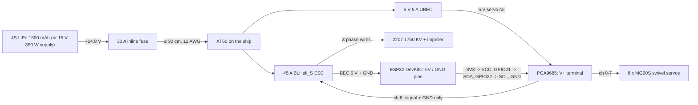

# Electronics: 926 tethered bench demo

- **Parts list:** [BOM.md](BOM.md), with Amazon links.
- **Firmware:** [`firmware/airship_bench`](firmware/airship_bench).

## Wiring

- **Common ground:** tie together the grounds of the ESC, the UBEC, the ESP32 and the PCA9685.
- **ESC red wire:** pull the red (BEC +5 V) pin out of the ESC's signal plug before it goes on PCA9685 channel 8. The ESC's BEC powers the ESP32 through separate leads, and the red wire would otherwise feed into the servo rail.
- **Separate supplies:** the servos run from the UBEC. The ESP32 and the PCA9685 logic run from the ESC's BEC, so servo stalls can't brown out the ESP32.
- **Thruster numbering:** thruster *i* is on seam *i*, at azimuth 22.5° + 45° × *i*, counter-clockwise from +X seen from above. It plugs into PCA9685 channel *i*.
- **Wire routing:**
  - **Motor wires:** nothing may cross the intake shaft. The three phase wires leave through the Ø6 hole in the fan hatch. Seal the hole around the wires (hot glue or silicone, so the hatch can still come off).
  - **Motor direction:** the impeller must turn **counter-clockwise seen from above**. The bayonet hatch also relies on that direction to stay locked. If it runs the wrong way, swap any two motor wires.
  - **Servo leads:** the servos sit inside the hull, between the skin and the shaft. That space isn't part of the air path, so run the leads along the ribs and out through a lower lattice window to the electronics on the bench.
  - **Electronics:** for the tethered bench demo the ESP32, PCA9685 and UBEC ride on the bench, not in the ship; there are no decks in the bench model. The ESC sits on the test stand just under the keel, next to the hatch, so the phase wires stay short.
  - **Battery leads:** keep the battery within about 30 cm of the ESC. For a longer tether, solder a 470 µF / 35 V low-ESR capacitor across the ESC's power input.

## Power budget

| Load | Typical | Peak |
|---|---|---|
| Fan (2207 1750 KV + 88 mm impeller) | ~75 W at the firmware's 60 % cap | ~340 W (~25 A at 14.8 V) at full throttle |
| 8 × MG90S | 1–1.5 A at 5 V | 5.6 A at 5 V if all stall (the UBEC limits this) |
| ESP32 + PCA9685 | 0.25 A at 5 V | 0.5 A |

- **Power source:** a 4S LiPo (1300–1800 mAh, 75C or better) is the simplest source that handles 25 A. At full throttle it runs about 3 minutes, which is plenty for thrust runs.
- **Mains alternative:** a 15 V 350 W supply (≈23 A). Keep the firmware's `THROTTLE_LIMIT` at 0.9 or below with it.
- **Don't use 12 V:** the fan needs about 15,700 rpm, and a 1750 KV motor only reaches that on 4S (see [../Analysis/AIRFLOW.md](../Analysis/AIRFLOW.md)).

## Bench bring-up
1. **Flash the firmware.**
   - Install the ESP32 board package and the "Adafruit PWM Servo Driver Library".
   - Open `firmware/airship_bench/airship_bench.ino` and flash it to the "ESP32 Dev Module".
2. **Check the servos with the impeller off.**
   - Join Wi-Fi "OpenAirShip" (the password is in the sketch; change it) and open http://192.168.4.1.
   - All 8 servos should centre, with lift at +1 and every jet pointing down.
   - Move the Yaw slider: every thruster should tilt the same way.
   - Set per-servo trim in `SERVO_TRIM_DEG`.
3. **Calibrate the ESC (impeller off).** Follow its manual: throttle high at power-on, then low. The firmware sends 1000–2000 µs.
4. **First spin (impeller on).**
   - Press ARM and raise the throttle slowly.
   - The firmware caps the throttle at 60 % (`THROTTLE_LIMIT`) until the impeller has been spun up and checked.
   - The fan stops on STOP, or within 1 s if the page loses its link.
5. **Measure.**
   - Put the ship on a kitchen scale: the weight drop is the lift.
   - With the optional sensors (BOM items 17–18), log plenum pressure and power against throttle.

## Firmware
- **`mixer.h`:** turns lift, surge, sway and yaw commands into 8 swivel angles. Every thruster pushes with about the same force because they share one fan, so the mixer steers direction only; the throttle sets magnitude.
- **Host test:** `g++ -std=c++17 -Iairship_bench test/test_mixer.cpp && ./a.out`, run from `firmware/`. It checks pure lift, yaw, surge, sway, the ±90° limits and the servo pulses. All of these pass.
- **`airship_bench.ino`:** the Wi-Fi access point, the control page, ESC arming and the link-loss failsafe. It has been compiled on a PC against stand-ins for the Arduino APIs, **but not yet built or run on a real ESP32**.
