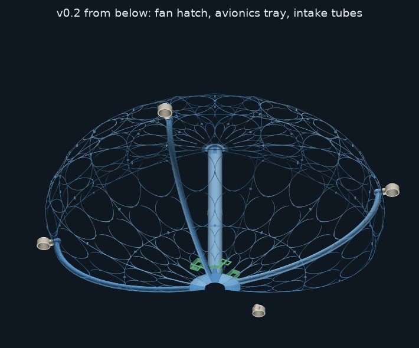

# OpenAirShips
Free Travel and Total Liberty for All Humanity

All relevant information is on http://OpenAirShips.com. Pop in and join the conversation on our Discord: https://discord.gg/wZ6nu7H

## Build it: the 926 model, v0.2

The first buildable OpenAirShip is a 3D-printable model. It has a smooth ellipsoid hull of printed slices, a shrouded fan in a smooth central intake, and vectoring air-multiplier thrusters on the equator. Everything is open source.

### New in v0.2: it floats
The **double-Kobra build** is 1.58 m across. It carries its own battery and ESP32 controller and **floats on hydrogen alone**, for indoor flights in a garage or warehouse.
- **Hull:** 12 slices (4 left, 4 right, 4 plain). Each prints in 5 pieces on an Anycubic Kobra Max, and the intake shaft is two printed tubes.
- **Weight:** 903 g all-up in full-foam lightweight PLA with a 1500 mAh LiPo. Its 1022 L of hydrogen lifts 1145 g, so it has **242 g to spare**, and about 44 minutes of flight.
  - An 18650 pack gives 83 minutes, with 227 g to spare.
  - Every foam and battery option floats; see [FLOAT.md](CurrentModel/Analysis/FLOAT.md).
  - On helium it still floats, with about 160 g to spare.
- **Downloads:**
  - [Print files: 15 hull pieces + 2 intake tubes](CurrentModel/Print%20Files/v0.2%20double%20Kobra)
  - [Propulsion and avionics tray STLs](CurrentModel/CAD%20Files/Propulsion/4T/small/12s/x3.8/print)
  - [Build notes](CurrentModel/CAD%20Files/SimplifiedSlice/README.md#v02-double-kobra-build-x38-158-m-12-slices-in-pieces)
  - [Self-contained electronics](CurrentModel/Electronics/README.md#v02-self-contained-build-no-tether)
  - [BOM changes](CurrentModel/Electronics/BOM.md#v02-self-contained-double-kobra-build-changes-to-the-list-above)

### v0.1: bench and Kobra Max models (tethered)
| | 8 thrusters | 4 thrusters |
|---|---|---|
| **Bench size, 415 mm** (Prusa MK3S+) | [PieSlice926-v0.1-8T.stl](CurrentModel/Print%20Files/PieSlice926-v0.1-8T.stl), print 8 | [left](CurrentModel/Print%20Files/PieSlice926-v0.1-4T-left.stl) and [right](CurrentModel/Print%20Files/PieSlice926-v0.1-4T-right.stl), print 4 of each |
| **Kobra Max size, 790 mm** (Anycubic Kobra Max) | [PieSlice926-v0.1-8T-KobraMax.stl](CurrentModel/Print%20Files/PieSlice926-v0.1-8T-KobraMax.stl), print 8 | [left](CurrentModel/Print%20Files/PieSlice926-v0.1-4T-left-KobraMax.stl) and [right](CurrentModel/Print%20Files/PieSlice926-v0.1-4T-right-KobraMax.stl), print 4 of each |
| **Propulsion parts (STL)** | [bench](CurrentModel/CAD%20Files/Propulsion/print) · [Kobra Max](CurrentModel/CAD%20Files/Propulsion/x1.9/print) | [bench](CurrentModel/CAD%20Files/Propulsion/4T/print) · [Kobra Max](CurrentModel/CAD%20Files/Propulsion/4T/x1.9/print) |
| **Expected thrust** | ≈ 408 gf | ≈ 422 gf |

These don't float on hydrogen alone, but the 4-thruster Kobra Max model in full-foam lightweight PLA (509 g, 124 L of hydrogen) can hover on its fan with 49 g to spare.

| | |
|---|---|
| **CAD (FreeCAD, STEP, parametric Python)** | [Hull slices](CurrentModel/CAD%20Files/SimplifiedSlice) · [Propulsion](CurrentModel/CAD%20Files/Propulsion) |
| **Bill of materials** | [Electronics/BOM.md](CurrentModel/Electronics/BOM.md): about $230–320 for the core parts, with Amazon links, a lightweight-PLA option and the v0.2 changes |
| **Build notes** | [Hull slice](CurrentModel/CAD%20Files/SimplifiedSlice/README.md) · [Propulsion](CurrentModel/CAD%20Files/Propulsion/README.md) · [Electronics and firmware](CurrentModel/Electronics/README.md) |
| **Engineering** | [Will it float?](CurrentModel/Analysis/FLOAT.md) · [Airflow](CurrentModel/Analysis/AIRFLOW.md) · [Airflow, 4 thrusters](CurrentModel/Analysis/AIRFLOW-4T.md) · [Design constraints](CurrentModel/DESIGN-CONSTRAINTS.md) · [Open questions](CurrentModel/OPEN-QUESTIONS.md) |
| **Changelog** | [v0 → v0.2](CurrentModel/CHANGELOG.md) |

**At a glance**
- **Hull:** 0.86 mm airtight walls. The outside is a smooth ellipsoid, and it's lattice everywhere except the air path. The intake is Ø66 from the bellmouth down to the fan.
- **Fan:** a 2207 1750 KV motor on 4S drives an 88 mm PETG impeller, and the hull's housing wall is its shroud. It comes out through a bayonet hatch in the keel.
- **Thrusters:** 8 or 4, each swivelling ±90° on a micro servo, exactly on the equator.
- **Control:** an ESP32 with a Wi-Fi control page and a link-loss failsafe. It drives a PCA9685 on the bench models, or the servos and ESC directly on v0.2, with a battery monitor.

## Repository layout
| Folder | What's in it |
|---|---|
| [`CurrentModel/`](CurrentModel) | **The current buildable model (926 v0.2):** CAD, print files, propulsion, electronics, firmware, analysis and [changelog](CurrentModel/CHANGELOG.md) |
| [`web/`](web) | Source for [OpenAirShips.com](http://OpenAirShips.com) (static site on Cloudflare) |
| [`docs/`](docs) | Project notes: website deployment and content audit, the Unreal diagnostic report |
| [`WhitePaper/`](WhitePaper) | Whitepaper and builder guide |
| [`Art/`](Art), [`vidz/`](vidz) | Logos, concept art and concept videos |
| [`WebSnap2024/`](WebSnap2024) | PDFs of the 2024 website |
| [`OldFiles/`](OldFiles) | Earlier models and print files, kept for history |
