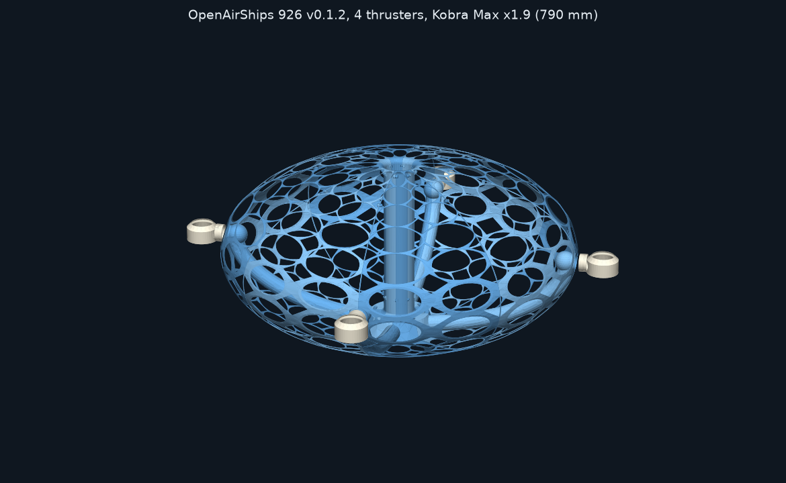
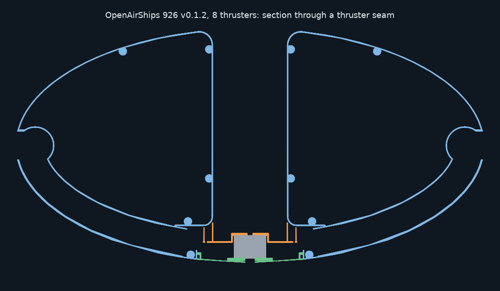
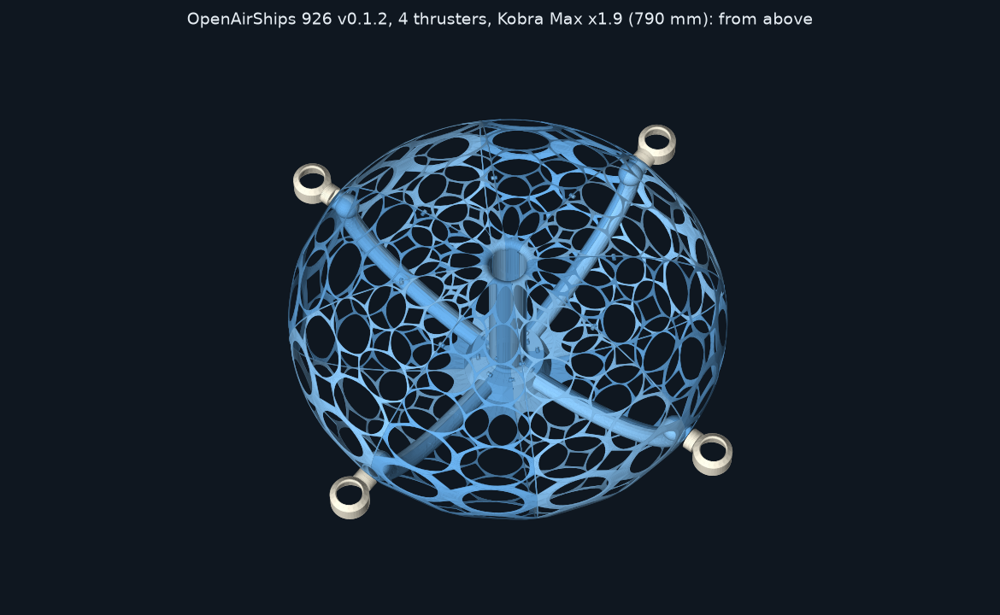

# OpenAirShips
Free Travel and Total Liberty for All Humanity

All relevant information is on http://OpenAirShips.com. Pop in and join the conversation on our Discord: https://discord.gg/wZ6nu7H

## Build it: the 926 model, v0.1.2

The first buildable OpenAirShip is a 3D-printable, tethered model. It's made of 8 hull slices, a shrouded fan in a smooth central intake, and vectoring air-multiplier thrusters on the equator. It comes in two designs and two sizes. Everything is open source.

| | 8 thrusters | 4 thrusters |
|---|---|---|
| **Bench size, 415 mm** (Prusa MK3S+) | [PieSlice926-v0.1-8T.stl](CurrentModel/Print%20Files/PieSlice926-v0.1-8T.stl), print 8 | [left](CurrentModel/Print%20Files/PieSlice926-v0.1-4T-left.stl) and [right](CurrentModel/Print%20Files/PieSlice926-v0.1-4T-right.stl), print 4 of each |
| **Kobra Max size, 790 mm** (Anycubic Kobra Max) | [PieSlice926-v0.1-8T-KobraMax.stl](CurrentModel/Print%20Files/PieSlice926-v0.1-8T-KobraMax.stl), print 8 | [left](CurrentModel/Print%20Files/PieSlice926-v0.1-4T-left-KobraMax.stl) and [right](CurrentModel/Print%20Files/PieSlice926-v0.1-4T-right-KobraMax.stl), print 4 of each |
| **Propulsion parts (STL)** | [bench](CurrentModel/CAD%20Files/Propulsion/print) · [Kobra Max](CurrentModel/CAD%20Files/Propulsion/x1.9/print) | [bench](CurrentModel/CAD%20Files/Propulsion/4T/print) · [Kobra Max](CurrentModel/CAD%20Files/Propulsion/4T/x1.9/print) |
| **Expected thrust** | ≈ 408 gf | ≈ 422 gf |

| | |
|---|---|
| **CAD (FreeCAD, STEP, parametric Python)** | [Hull slices](CurrentModel/CAD%20Files/SimplifiedSlice) · [Propulsion](CurrentModel/CAD%20Files/Propulsion) |
| **Bill of materials** | [Electronics/BOM.md](CurrentModel/Electronics/BOM.md): about $230–320 for the core parts, with Amazon links, and a lightweight-PLA option |
| **Build notes** | [Hull slice](CurrentModel/CAD%20Files/SimplifiedSlice/README.md) · [Propulsion](CurrentModel/CAD%20Files/Propulsion/README.md) · [Electronics and firmware](CurrentModel/Electronics/README.md) |
| **Engineering** | [Will it float?](CurrentModel/Analysis/FLOAT.md) · [Airflow](CurrentModel/Analysis/AIRFLOW.md) · [Airflow, 4 thrusters](CurrentModel/Analysis/AIRFLOW-4T.md) · [Design constraints](CurrentModel/DESIGN-CONSTRAINTS.md) · [Open questions](CurrentModel/OPEN-QUESTIONS.md) |
| **Changelog** | [v0 → v0.1 → v0.1.1 → v0.1.2](CurrentModel/CHANGELOG.md) |

**Will it float?** Not yet on hydrogen alone. The 4-thruster Kobra Max model in lightweight PLA weighs about 624–743 g and holds 124 L of hydrogen, which lifts 139 g (19–22% of its weight). With the fan running, it's 67–185 g short of hovering. The bench-size 4-thruster model in fully foamed lightweight PLA *can* hover on its fan. Floating on hydrogen alone needs a hull about 1.7–1.9 m across. The full budget is in [FLOAT.md](CurrentModel/Analysis/FLOAT.md).

**At a glance**
- **Hull:** 8 slices with 0.86 mm airtight walls. The outside is a smooth ellipsoid, and it's lattice everywhere except the air path. The intake is Ø66 from the bellmouth down to the fan.
- **Fan:** a 2207 1750 KV motor on 4S drives an 88 mm PETG impeller, and the hull's housing wall is its shroud. It comes out through a bayonet hatch in the keel.
- **Thrusters:** 8 or 4, each swivelling ±90° on an MG90S servo, exactly on the equator.
- **Control:** an ESP32 and a PCA9685, with a Wi-Fi control page and a link-loss failsafe.

## Repository layout
| Folder | What's in it |
|---|---|
| [`CurrentModel/`](CurrentModel) | **The current buildable model (926 v0):** CAD, print files, propulsion, electronics, firmware, analysis and [changelog](CurrentModel/CHANGELOG.md) |
| [`web/`](web) | Source for [OpenAirShips.com](http://OpenAirShips.com) (static site on Cloudflare) |
| [`docs/`](docs) | Project notes: website deployment and content audit, the Unreal diagnostic report |
| [`WhitePaper/`](WhitePaper) | Whitepaper and builder guide |
| [`Art/`](Art), [`vidz/`](vidz) | Logos, concept art and concept videos |
| [`WebSnap2024/`](WebSnap2024) | PDFs of the 2024 website |
| [`OldFiles/`](OldFiles) | Earlier models and print files, kept for history |
